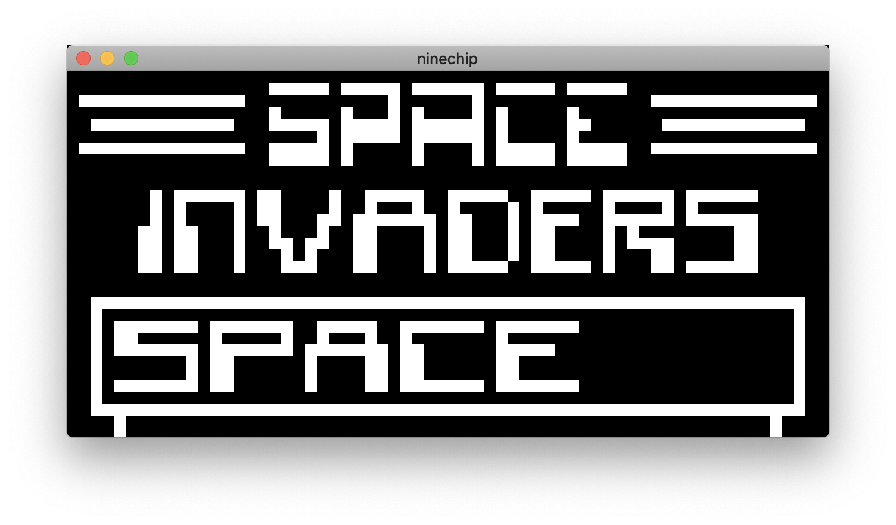
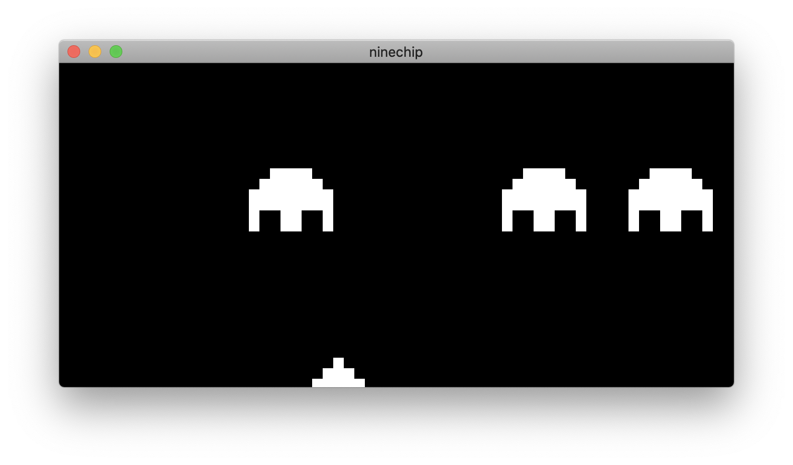

# ninechip
An interpreter for the Chip-8 language, created in Java.




## Controls
The 16-key keypad of the CHIP-8 is as follows:

|1|2|3|C|
|:---:|:---:|:---:|:---:|
|4|5|6|D|
|7|8|9|E|
|A|0|B|F|

On a QWERTY keyboard, this is how the above keypad is mapped:


|1|2|3|4|
|:---:|:---:|:---:|:---:|
|Q|W|E|R|
|A|S|D|F|
|Z|X|C|V|

## Dependencies
Running ninechip will require Java 15+ and Maven.

## Compilation Instructions
```
mvn package
cd target/
java -jar ninechip-1.0.jar <path/to/ROMFile>
```

## Resources Used
trekawek's [coffee-gb](https://github.com/trekawek/coffee-gb) repo was a great reference for improving the structural decomposition of the emulator.

In addition, a tutorial made by [Austin Morlan](https://austinmorlan.com/posts/chip8_emulator) helped me debug some opcodes.

## Special Thanks
This project would not have been possible without Kanye West, Tyler, the Creator, my cousin Danny, and the Twitch streamers still live at 2AM.
